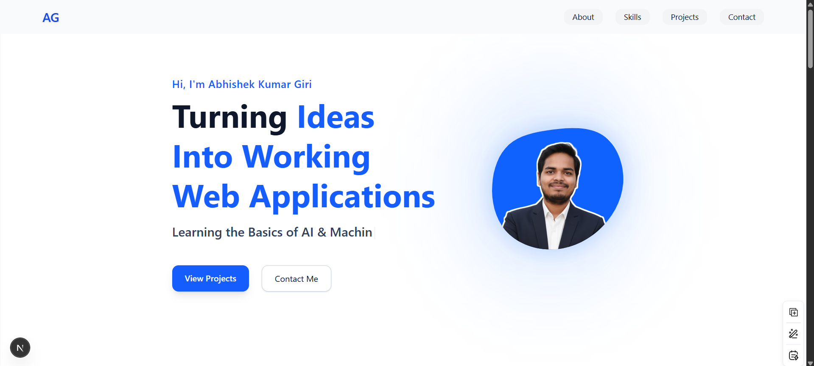

# 🌐 Abhishek Kumar Giri — Developer Portfolio

Welcome to my personal developer portfolio!  
This website represents my journey as a **B.Tech IT student at USICT, GGSIPU**, and an aspiring **Full-Stack Web Developer (MERN)** exploring **AI/ML**.

It highlights my projects, skills, experience, and the technologies I work with — all wrapped in a clean, modern, animated UI.

---

## 📸 Portfolio Preview  

> _(Place your screenshot inside `/public/portfolio-preview.png` or rename accordingly)_

---

## 🚀 Live Demo  
🔗 **Coming Soon…** _(Will be deployed on Vercel later)_

🔗 **GitHub Repository:** https://github.com/abhi1913ek-79ri  

---

## 🎯 Features

### ⭐ Beautiful Modern UI  
- Smooth transitions using **Framer Motion**  
- Animated Blob Profile Image  
- Typewriter Effect in Hero Section  
- Clean typography + gradient design  

### ⭐ Responsive Design  
Works flawlessly on **mobile, tablet, and desktop**.

### ⭐ Fully Structured Sections  
- **Hero:** Intro + Call-To-Actions  
- **About:** Story + Education  
- **Skills:** Categorized skills with badges & progress bars  
- **Projects:** Cards with previews & GitHub links  
- **Contact:** EmailJS-powered contact form  

### ⭐ Integrated Contact Form  
Visitors can send messages directly to your Gmail using **EmailJS**.

---

## 🧠 Tech Stack

### **Frontend**
- React.js  
- Next.js  
- Tailwind CSS  
- Framer Motion  
- Typewriter.js  

### **Backend**
- Node.js  
- Express.js  

### **Databases**
- MongoDB  
- MySQL  
- SQLite  

### **Programming**
- C++  
- C  
- Python  

### **Fundamentals**
- DBMS  
- OOP (C++)  
- DSA  

### **Tools**
- Git  
- GitHub  
- VS Code  
- Figma  
- Canva  

---

## 📂 Project Structure
root/
│
├── public/
│ ├── favicon.ico
│ ├── profile.png
│ ├── portfolio-preview.png ← (your screenshot here)
│
├── app/
│ ├── components/
│ │ ├── Hero.jsx
│ │ ├── About.jsx
│ │ ├── Skills.jsx
│ │ ├── Projects.jsx
│ │ ├── Contact.jsx
│ │
│ ├── globals.css
│ ├── layout.jsx
│ ├── page.jsx
│
├── package.json
├── tailwind.config.js
├── README.md

---

## 📬 Contact Me

📧 **Email:** ag1161534@gmail.com  
🔗 **LinkedIn:** https://www.linkedin.com/in/abhishek-kumar-giri-abhi1913ek-79ri/  
🐙 **GitHub:** https://github.com/abhi1913ek-79ri  

Feel free to reach out for collaborations, internships, or project work!

---

## 💡 Future Enhancements  
- Add blog section  
- Add admin dashboard for updating portfolio content  
- Add dark mode  
- Add animations to project cards  
- Add project filtering system  

---

## 🏆 Author

**Abhishek Kumar Giri (Golu)**  
B.Tech (Information Technology), USICT – GGSIPU  
Full-Stack Developer in Training | AI/ML Learner  

---

## ⭐ Support  
If you like this portfolio, please ⭐ star the repo —  
Your support motivates me to build more cool projects! 🚀
